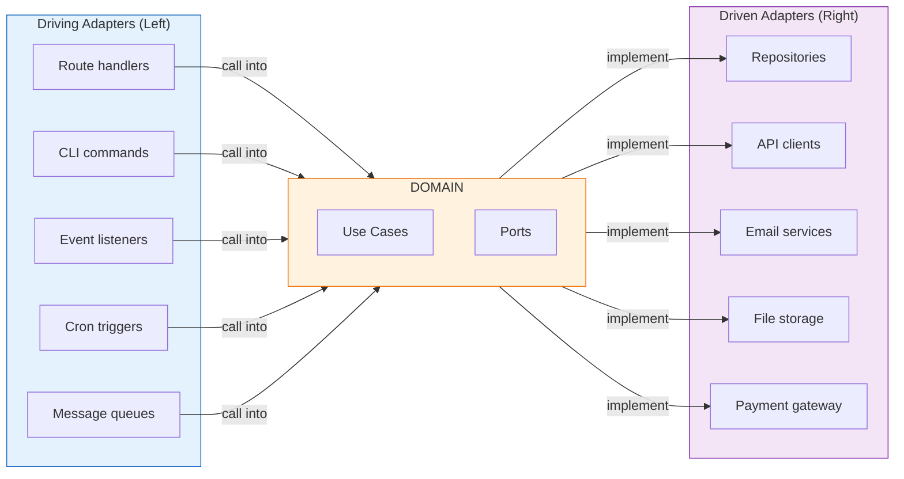

# Chapter 6: Hexagonal Architecture — Ports, Adapters, and the Dependency Rule

## 1. The Core Concept

Here is the single most important idea in this chapter: **your business logic should not know that databases, HTTP, or the internet exist.**

Think about what happens when you write a function like `placeOrder`. The business rules — check inventory, calculate totals, apply discounts, validate payment — are the same whether the order arrives via a REST API, a CLI command, or a message queue. They are the same whether you store orders in PostgreSQL, DynamoDB, or a flat file. The business rules are *your product*. Everything else is plumbing.

Hexagonal architecture (also called Ports & Adapters) enforces this separation structurally. Business logic lives at the center of the system. External systems — databases, APIs, UIs, message queues — connect to the center through well-defined boundaries. Dependencies always point inward. The domain never reaches out; the outside world plugs in.

A **port** is a contract: "I need something that can find users by ID." An **adapter** is a specific fulfillment of that contract: "Here is something that finds users by ID using Drizzle and D1." The domain defines what it needs. The infrastructure delivers it. This is the Dependency Rule: source code dependencies point inward. Adapters import from domain. Domain never imports from adapters.

Why does this matter in practice? Three reasons:

1. **Testability.** When your domain has no infrastructure dependencies, you can test it with plain function calls and in-memory fakes. No database setup, no HTTP mocking, no flaky CI.
2. **Changeability.** Swapping PostgreSQL for DynamoDB means writing one new adapter. The domain, the use cases, and all the use case tests remain untouched.
3. **Clarity.** Business rules are not scattered across route handlers, repository implementations, and middleware. They live in one place, in pure functions, readable by anyone who understands the domain.

This is not academic architecture. It is the most practical thing you can do to keep a TypeScript codebase maintainable as it grows.

---

## 2. The Asymmetry That Matters

Not all adapters are the same. There are two kinds, and the distinction is fundamental.



**Driving adapters** (left side) initiate actions on the application. They *call* use cases. A route handler receives an HTTP request, parses it, wires up the dependencies, and calls a use case function. A CLI command does the same from a terminal. A queue consumer does the same from a message. The use case does not know or care which one triggered it.

**Driven adapters** (right side) are things the application reaches out to. They *implement* port interfaces defined by the domain. A repository adapter implements `UserRepository`. A payment adapter implements `PaymentGateway`. The domain says "I need something that can charge a credit card." The adapter says "I will do that using Stripe."

This asymmetry is important because it tells you which direction the dependency flows. Driving adapters depend on use cases. Driven adapters implement interfaces that the domain defines. In both cases, the domain is in control.

---

## 3. Ports = Interfaces (Behavior Contracts)

Ports are the boundaries of your hexagon. They are TypeScript `interface` types that define what the domain needs from the outside world.

### Port Design Principles

**Name ports by business purpose, not technology.** The domain does not know what a database is. It knows what a `UserRepository` is.

**Use domain types, never infrastructure types.** Port methods accept and return domain types like `User`, `UserId`, and `Money`. They never expose `SqlRow`, `HttpResponse`, or `D1Result`.

**One port per aggregate or capability.** A `UserRepository` for user persistence. A `PaymentGateway` for payment processing. Not one god port that does everything, and not ten micro-ports for individual queries.

### Bad: Technology-Shaped Port

```typescript
// BAD — this port is shaped like a database, not like a business need
interface DatabasePort {
  findBySqlQuery(sql: string): Promise<any[]>;
  executeStatement(sql: string, params: unknown[]): Promise<void>;
}
```

This is not a port. This is a database driver wearing a trenchcoat. Any code that uses this port is coupled to SQL. Swapping to DynamoDB would require rewriting every caller.

### Good: Business-Shaped Port

```typescript
// GOOD — named by purpose, uses domain types, no technology leakage
interface UserRepository {
  readonly findById: (id: UserId) => Promise<User | undefined>;
  readonly findByEmail: (email: Email) => Promise<User | undefined>;
  readonly save: (user: User) => Promise<void>;
}

interface PaymentGateway {
  readonly charge: (
    amount: Money,
    paymentInfo: PaymentInfo,
  ) => Promise<ChargeResult>;
}
```

Notice the return types. `findById` returns `User | undefined`, not `DatabaseRow | null`. `charge` returns `ChargeResult`, not `StripeChargeResponse`. The port speaks the language of the domain.

Port interfaces live in the domain layer, alongside the entity they serve — typically in a file like `src/domain/user/repository.ts`. This is not a detail; it encodes the dependency rule. The domain defines what it needs. The adapter layer provides it.

---

## 4. Adapters = Implementations

An adapter implements a port for a specific technology. A good adapter is simple: it translates between the port's domain types and the technology's native types. It contains **zero business logic**.

### Real Adapter: Drizzle/D1

```typescript
// src/db/repositories/drizzle-user-repository.ts
const createDrizzleUserRepository = (db: D1Database): UserRepository => ({
  findById: async (id) => {
    const row = await db
      .select()
      .from(users)
      .where(eq(users.id, id))
      .get();
    return row ? toDomainUser(row) : undefined;
  },

  findByEmail: async (email) => {
    const row = await db
      .select()
      .from(users)
      .where(eq(users.email, email))
      .get();
    return row ? toDomainUser(row) : undefined;
  },

  save: async (user) => {
    await db
      .insert(users)
      .values(toDbRow(user))
      .onConflictDoUpdate({ target: users.id, set: toDbRow(user) });
  },
});
```

The `toDomainUser` and `toDbRow` functions handle the translation between database rows and domain types. This is the adapter's only job.

### Fake Adapter: In-Memory Map

```typescript
// test/fakes/fake-user-repository.ts
const createFakeUserRepository = (
  initial: readonly User[] = [],
): UserRepository & { readonly savedEntities: readonly User[] } => {
  const store = new Map(initial.map((u) => [u.id, u]));
  const saved: User[] = [];
  return {
    findById: async (id) => store.get(id),
    findByEmail: async (email) =>
      [...store.values()].find((u) => u.email === email),
    save: async (user) => {
      store.set(user.id, user);
      saved.push(user);
    },
    get savedEntities() {
      return saved;
    },
  };
};
```

Both adapters implement the same `UserRepository` interface. The domain does not know which one it is talking to. This is the entire point.

### The Swappability Test

This is the litmus test for whether your boundaries are correct: **if swapping an adapter requires changing domain code, the boundary is wrong.**

Swap PostgreSQL for DynamoDB? Only the repository adapter changes. Swap Stripe for PayPal? Only the payment adapter changes. Use case tests continue to pass with any adapter because they use fakes. If any swap forces you to touch domain code or use case tests, you drew the boundary in the wrong place.

---

## 5. Dependency Injection Without a Framework

You do not need a DI container. You do not need decorators, tokens, or service locators. You need function parameters.

### Bad: Hardcoded Dependencies

```typescript
// BAD — creates dependencies internally (untestable, tightly coupled)
const createOrder = async (order: NewOrder) => {
  const repo = new DrizzleOrderRepo(getDb());
  const gateway = new StripeGateway(process.env.STRIPE_KEY!);

  const charge = await gateway.charge(order.total, order.payment);
  if (!charge.success) return { success: false, reason: charge.error };

  await repo.save({ ...order, chargeId: charge.id });
  return { success: true };
};
```

This function is married to Drizzle and Stripe. You cannot test it without a real database and a real Stripe account (or elaborate mocking). You cannot swap either dependency without rewriting the function.

### Good: Dependencies as Parameters

```typescript
// GOOD — dependencies injected via parameters (testable, swappable)
const createOrder = async (
  repo: OrderRepository,
  gateway: PaymentGateway,
  order: NewOrder,
): Promise<OrderResult> => {
  const charge = await gateway.charge(order.total, order.payment);
  if (!charge.success) return { success: false, reason: charge.error };

  const saved = await repo.save({ ...order, chargeId: charge.id });
  return { success: true, order: saved };
};
```

Now you can pass fakes in tests, real adapters in production, and different real adapters when you migrate to a new payment provider. The function does not know or care.

You can tell a use case from a domain function by its signature: use cases take ports (repositories, gateways) as parameters. Domain functions take only domain types.

### The "Impureim Sandwich"

This pattern, described by Mark Seemann, structures each request as three layers:

1. **Impure:** Gather dependencies, parse input (driving adapter)
2. **Pure:** Execute business logic (use case + domain functions)
3. **Impure:** Persist results, send responses (driving adapter)

The driving adapter is the bread. The domain logic is the filling.

### The Composition Root

Wiring happens at the application entry point — where adapters are created from environment/config and injected into use cases. This is the only place that knows about concrete implementations.

```typescript
// Route handler = composition root + driving adapter
export async function POST(request: Request) {
  const { env } = getCloudflareContext();
  const db = createDb(env.DB);

  // Impure: wire adapters
  const repo = createDrizzleOrderRepository(db);
  const gateway = createStripeGateway(env.STRIPE_KEY);

  // Impure: parse input at the boundary
  const body = CreateOrderSchema.parse(await request.json());

  // Pure: call use case (business logic)
  const result = await createOrder(repo, gateway, body);

  // Impure: translate result to HTTP response
  return NextResponse.json(result);
}
```

The route handler is thin glue: parse input, wire adapters, call use case, return response. No business logic lives here.

Non-HTTP driving adapters follow the identical pattern. A queue consumer parses a message, wires adapters, and calls the same use case. A CLI command parses arguments, wires adapters, and calls the same use case. The use case does not know or care which one triggered it.

---

## 6. CQRS-Lite — When Reads and Writes Need Different Shapes

Not all reads should go through repositories. The repository pattern enforces aggregate boundaries — essential for writes, but reads often need to JOIN across aggregates for display.

If you force all reads through repositories, you end up with either:
- **N+1 queries:** load each aggregate separately, assemble in code
- **Broken boundaries:** repositories that JOIN across aggregates (defeating their purpose)
- **Denormalized read tables:** full CQRS, usually overkill

CQRS-lite is the pragmatic middle ground: writes go through repositories, reads use query functions that JOIN freely.

| Operation | Pattern | Example |
|-----------|---------|---------|
| Write | Repository (one aggregate) | `orderRepo.save(order)` |
| Read (single aggregate) | Repository | `orderRepo.findById(id)` |
| Read (cross-aggregate, display) | Query function | `getDashboardView(db, userId)` |

### Query Functions Are Driven Adapters

Query functions live in the adapter layer (e.g., `src/db/queries/`) and return read-optimized DTOs. They bypass the repository pattern intentionally.

```typescript
// src/db/queries/dashboard.ts — JOINs across aggregates for display
const getDashboardCards = async (db: Database, userId: string) => {
  return db
    .select({
      eventTitle: events.title,
      occasionEmoji: occasions.emoji,
      savedAmount: savingsGoals.savedAmount,
      recipientName: recipients.name,
    })
    .from(events)
    .innerJoin(occasions, eq(occasions.eventId, events.id))
    .leftJoin(savingsGoals, eq(savingsGoals.occasionId, occasions.id))
    .innerJoin(recipients, eq(recipients.id, occasions.recipientId))
    .where(eq(events.userId, userId))
    .all();
};
```

Domain-layer pure functions can then transform query results into display types, encoding business rules about what the data means. For example, a `toDashboardCard` function might compute `isUrgent: daysAway < 30` — that threshold is a business rule and belongs in domain, not in the query. The query fetches; the domain function interprets.

Start with CQRS-lite. Most applications never need full CQRS.

---

## 7. File Organization

| Layer | Location | Contains | Tests |
|-------|----------|----------|-------|
| Domain | `src/domain/` | Business logic (pure functions), types, port interfaces, use cases | Unit + use case tests (fakes) |
| Adapters (driven) | `src/db/`, `src/infrastructure/` | Repository impls, API clients, query functions | Integration tests (real DB / MSW) |
| Adapters (driving) | `src/app/` | Route handlers, event listeners | E2E tests (Playwright) |
| Wiring | `src/lib/`, `src/context.ts` | Adapter factories, config | Covered by E2E |

A concrete example:

```
src/
  domain/
    order/
      types.ts              # Order, OrderItem, Money, branded IDs
      order.ts              # Pure business logic (calculateTotal, applyDiscount)
      place-order.ts        # Use case (takes ports as params)
      repository.ts         # OrderRepository interface (port)
    payment/
      types.ts              # ChargeResult, PaymentInfo
      gateway.ts            # PaymentGateway interface (port)
  db/
    repositories/
      drizzle-order-repository.ts    # Driven adapter
    queries/
      dashboard.ts                    # CQRS-lite query function
    schema.ts                         # Drizzle table definitions
  app/
    api/orders/
      route.ts              # Driving adapter (route handler)
tests/
  orders/
    place-order.test.ts     # Use case tests (primary)
    order-rules.test.ts     # Domain unit tests (complement)
  fakes/
    fake-order-repository.ts
    fake-payment-gateway.ts
```

**The key rule: domain has zero external dependencies.** No framework imports, no database imports, no HTTP imports. If you see `import { eq } from 'drizzle-orm'` in a file under `src/domain/`, the architecture is broken. Adapters import from domain, never the reverse.

---

## 8. Testing Strategy

This is the primary benefit of hexagonal architecture. If you are not leveraging it for testing, you are paying the architectural tax without collecting the dividend.

### The Testing Pyramid for Hex Arch

| Priority | Boundary | What It Proves | Speed |
|----------|----------|----------------|-------|
| **Primary** | Use case (faked driven ports) | Feature works end-to-end within the hexagon | Fast |
| **Complement** | Domain pure functions | Complex business rules in isolation | Very fast |
| **Secondary** | Driven adapters (real DB / MSW) | Adapter translates correctly | Slower |
| **Verification** | E2E (full stack) | User experience works | Slowest |

### Primary: Use Case Tests with Fakes

Call the use case with driven ports replaced by in-memory fakes. This exercises the full business logic path without touching infrastructure.

```typescript
describe('place order', () => {
  it('saves order and charges payment on success', async () => {
    const orderRepo = createFakeOrderRepo();
    const paymentGateway = createFakePaymentGateway({ alwaysSucceeds: true });

    const result = await placeOrder(orderRepo, paymentGateway, testOrder);

    expect(result.success).toBe(true);
    expect(orderRepo.savedEntities).toHaveLength(1);
  });

  it('does not save order when payment fails', async () => {
    const orderRepo = createFakeOrderRepo();
    const paymentGateway = createFakePaymentGateway({ alwaysFails: true });

    const result = await placeOrder(orderRepo, paymentGateway, testOrder);

    expect(result.success).toBe(false);
    expect(orderRepo.savedEntities).toHaveLength(0);
  });
});
```

This proves the feature works — not just that individual components return correct values.

### Fakes Over Mocks

This is a hill worth dying on. Use fakes, not mocks.

**Fakes** implement the real interface and maintain state. They behave like simplified versions of the real thing.

```typescript
const createFakeOrderRepo = (): OrderRepository & {
  readonly savedEntities: readonly Order[];
} => {
  const saved: Order[] = [];
  const store = new Map<string, Order>();
  return {
    findById: async (id) => store.get(id),
    save: async (order) => {
      store.set(order.id, order);
      saved.push(order);
    },
    get savedEntities() {
      return saved;
    },
  };
};
```

**Mocks** verify call sequences: "was `.save()` called with these arguments?" This couples your tests to implementation details. Refactor the internals — reorder two calls, extract a helper — and mocks break even though behavior is unchanged.

Fakes test behavior ("was the data saved?"). Mocks test choreography ("was `.save()` called exactly once with exactly these arguments in exactly this order?"). Behavior survives refactoring. Choreography does not.

One additional advantage: if the port interface changes, fakes break at compile time. Mocks silently drift from the real contract and pass tests that should fail.

Note on mutability in fakes: fakes use mutable internal state (`Map.set`, `Array.push`) to simulate a data store. This is a deliberate testing-only exception to the immutability rule. Fakes are test infrastructure, not domain code. The domain types they store remain immutable.

### Complement: Domain Pure Function Tests

For complex business rules with many edge cases, test the domain function directly:

```typescript
it('rejects contribution exceeding available balance', () => {
  const result = pledgeContribution(occasion, poorContributor, largePledge);
  expect(result.success).toBe(false);
  expect(result.reason).toBe('insufficient-balance');
});
```

Pure functions. No setup, no fakes, just values in and values out.

### Secondary: Driven Adapter Integration Tests

Verify that real adapters translate correctly between domain types and infrastructure:

```typescript
describe('DrizzleOrderRepository', () => {
  it('round-trips an order through persistence', async () => {
    const db = await createTestDb();
    const repo = createDrizzleOrderRepository(db);

    await repo.save(testOrder);

    expect(await repo.findById(testOrder.id)).toEqual(testOrder);
  });
});
```

These use a real database (in-memory SQLite or Testcontainers). They are slower and fewer in number. Their job is to catch translation bugs — wrong column mapping, incorrect serialization — not to verify business logic.

---

## 9. Cross-Cutting Concerns

Where does authentication go? Logging? Transactions? The answer is always the same: **not in the domain.**

| Concern | Where | Why |
|---------|-------|-----|
| Authentication (who are you?) | Driving adapter | Protocol-specific (JWT, session, API key) |
| Authorization (are you allowed?) | Domain | Business rule about permissions |
| Logging | Adapters (both sides) | Side effect, not business logic |
| Transactions | Adapter / composition root | Infrastructure concern |
| Error formatting | Driving adapter | Translates domain results to HTTP/gRPC |
| Input validation (schema) | Driving adapter boundary | Parse at the edge, trust inside |
| Business validation | Domain | Business rules are domain logic |

### Authentication vs. Authorization

**Authentication** (who are you?) lives in driving adapters. The route handler extracts the JWT/session, validates it, and passes a domain type like `ContributorId` to the use case. The domain never sees a token.

**Authorization** (are you allowed?) is a business rule and lives in the domain:

```typescript
// Domain: "only the organizer can close funding" is a business rule
const closeFunding = (
  occasion: Occasion,
  requesterId: ContributorId,
): CloseResult => {
  if (occasion.organizerId !== requesterId) {
    return { success: false, reason: 'not-organizer' };
  }
  return { success: true, occasion: { ...occasion, isFundingClosed: true } };
};
```

### Transactions

The use case does not know whether saves are transactional. The driving adapter wraps it:

```typescript
const createTransactionalPledgeHandler = (db: Database) =>
  async (dto: PledgeDto): Promise<PledgeResult> =>
    db.transaction(async (tx) => {
      const occasionRepo = createDrizzleOccasionRepository(tx);
      const contributorRepo = createDrizzleContributorRepository(tx);
      return handlePledge(occasionRepo, contributorRepo, dto);
    });
```

The use case function is unchanged. It still takes repositories as parameters. It does not know or care that those repositories share a transaction.

### Logging

The domain never imports a logger. If you need to observe domain behavior, the return values tell you everything. The driving adapter inspects the result and logs accordingly. Driven adapters can also log at infrastructure boundaries (query duration, connection failures). But domain code remains pure.

---

## 10. Anti-Patterns

These are the mistakes that erode hexagonal architecture from the inside. Each one seems harmless in isolation. Together, they turn your architecture into decoration.

### Domain Depending on Infrastructure

The most common violation. Domain code imports from frameworks, databases, or external services.

```typescript
// BAD — domain imports Drizzle
import { eq } from 'drizzle-orm';

export const findActiveUsers = async (db: Database) =>
  db.select().from(users).where(eq(users.active, true));
```

```typescript
// GOOD — domain defines the contract; adapter implements it
interface UserRepository {
  readonly findActive: () => Promise<readonly User[]>;
}
```

If your domain directory has a single import from `drizzle-orm`, `next`, `express`, `@aws-sdk`, or any infrastructure package, the architecture is compromised.

### Business Logic in Adapters

Route handlers or repositories contain business rules instead of delegating to domain.

```typescript
// BAD — business rule in route handler
export async function POST(request: Request) {
  const order = await orderRepo.findById(id);
  if (order.total > 1000) {
    await requireManagerApproval(order); // this is a business rule!
  }
  await orderRepo.save(order);
  return NextResponse.json(order);
}
```

```typescript
// GOOD — business rule in domain
const placeOrder = (order: Order): PlaceOrderResult => {
  if (order.total > 1000) {
    return { success: false, reason: 'requires-approval' };
  }
  return { success: true, order };
};
```

The test for this: could a non-technical product person read your domain code and recognize the business rule? If the rule is buried in a route handler between JSON parsing and HTTP status codes, the answer is no.

### Bypass Adapters

Route handler accesses the database directly, skipping the port entirely. You lose testability, swappability, and visibility.

```typescript
// BAD — route handler hits DB directly
export async function GET(request: Request) {
  const users = await db.select().from(users).where(eq(users.active, true));
  return NextResponse.json(users);
}

// GOOD — route handler calls through a port
const activeUsers = await getActiveUsers(userRepo);
return NextResponse.json(activeUsers);
```

### Technology-Shaped Ports

Port methods that expose technology details instead of speaking domain language. If a port method name contains a technology name (SQL, Redis, HTTP, Kafka), it is not a port. It is a leaky abstraction.

```typescript
// BAD — technology leaks into port
interface UserRepository {
  readonly findBySqlQuery: (sql: string) => Promise<User[]>;
  readonly getFromRedisCache: (key: string) => Promise<User>;
}

// GOOD — business language
interface UserRepository {
  readonly findActive: () => Promise<readonly User[]>;
  readonly findById: (id: UserId) => Promise<User | undefined>;
}
```

---

## Summary Checklist

Use this as a quick reference when designing or reviewing code that follows hexagonal architecture.

### Boundaries
- [ ] Domain logic has zero framework/infrastructure dependencies
- [ ] All external boundaries use ports (interfaces)
- [ ] Port interfaces live in domain, named by business purpose (not technology)
- [ ] Port methods use domain types only — no `SqlRow`, `HttpResponse`, or infrastructure types
- [ ] Swapping any adapter requires zero domain code changes

### Adapters
- [ ] Driving adapters (routes, CLI, queues) are thin — parse, wire, delegate, respond
- [ ] Driven adapters (repos, API clients) implement ports, contain no business logic
- [ ] Adapters translate between domain types and infrastructure types — nothing more
- [ ] Fakes implement the same port interface for testing

### Dependency Injection
- [ ] Dependencies injected via function parameters, never created internally
- [ ] Composition root (route handler / entry point) is the only place that knows concrete implementations
- [ ] Use cases are identifiable by signature — they take ports as parameters

### CQRS-Lite
- [ ] Writes go through repositories (enforce aggregate boundaries)
- [ ] Cross-aggregate reads use query functions (bypass repositories intentionally)
- [ ] Query functions live in the adapter layer, not domain

### Testing
- [ ] Primary tests: use case with faked driven ports (proves feature works)
- [ ] Fakes over mocks: fakes implement the real interface and maintain state
- [ ] Domain pure function tests for complex business rules
- [ ] Driven adapter integration tests verify translation correctness

### Cross-Cutting Concerns
- [ ] Authentication in driving adapters (protocol-specific)
- [ ] Authorization in domain (business rule)
- [ ] Logging in adapters, never in domain
- [ ] Transactions in adapter / composition root
- [ ] Domain returns result types — never throws for expected business outcomes
- [ ] Domain never imports a logger, catches HTTP errors, or manages transactions
